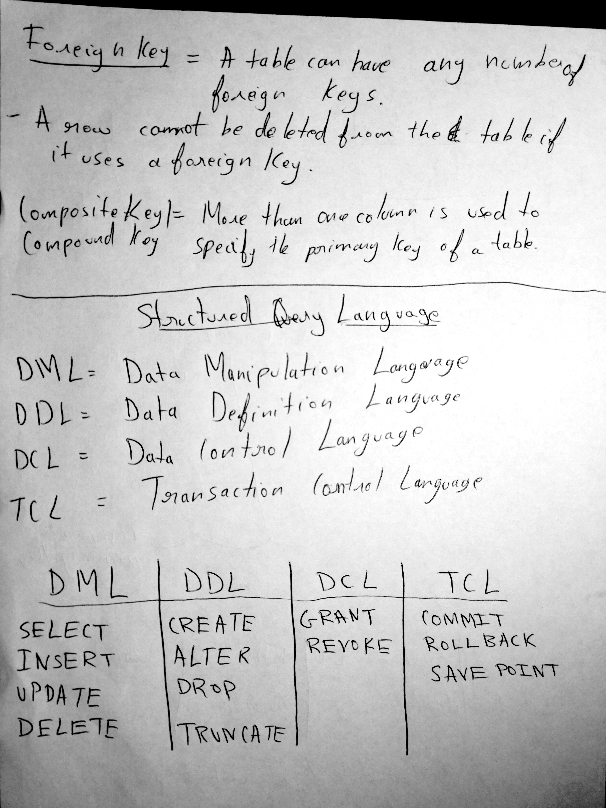
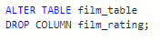

# Week 2  SQL Day 1
## Monday 11/05/2020
### Lecture Notes

- Primary key brings uniqueness
- if primary keybrings more than one column is called the composite primary key
- Candidate key has potential to be primary keys

#####  Lesson Notes Page 1

#####  Lesson Notes Page 2

#####  Lesson Notes Page 3

#####  Lesson Notes Page 4

#####  Lesson Notes Page 5

#####  Lesson Notes Page 6

#####  Lesson Notes Page 7

### SQL Example

The query shows the function to create table using the variables.

We use the INSERT INTO and VALUES to insert the values from the variable above.

Adding a column called film rating

Dropping the column film rating

This adds the variables of the table to the information provided from INSERT INTO and values.

We can use the command below to see the information from the table you have created.

The table displayed below appears when the command above is executed.

The DROP TABLE function deletes the table

