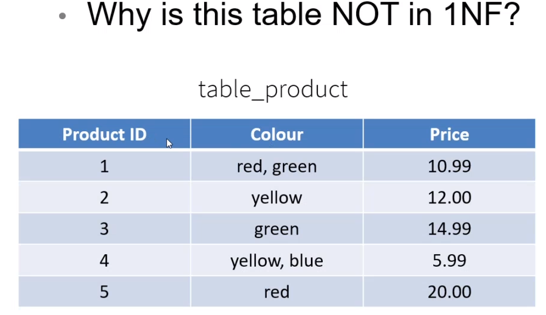
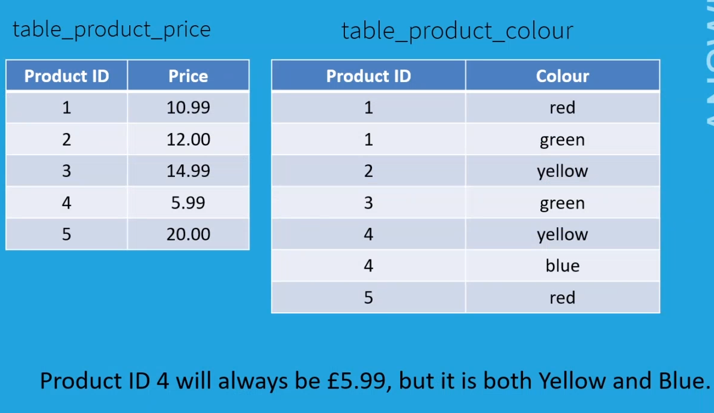
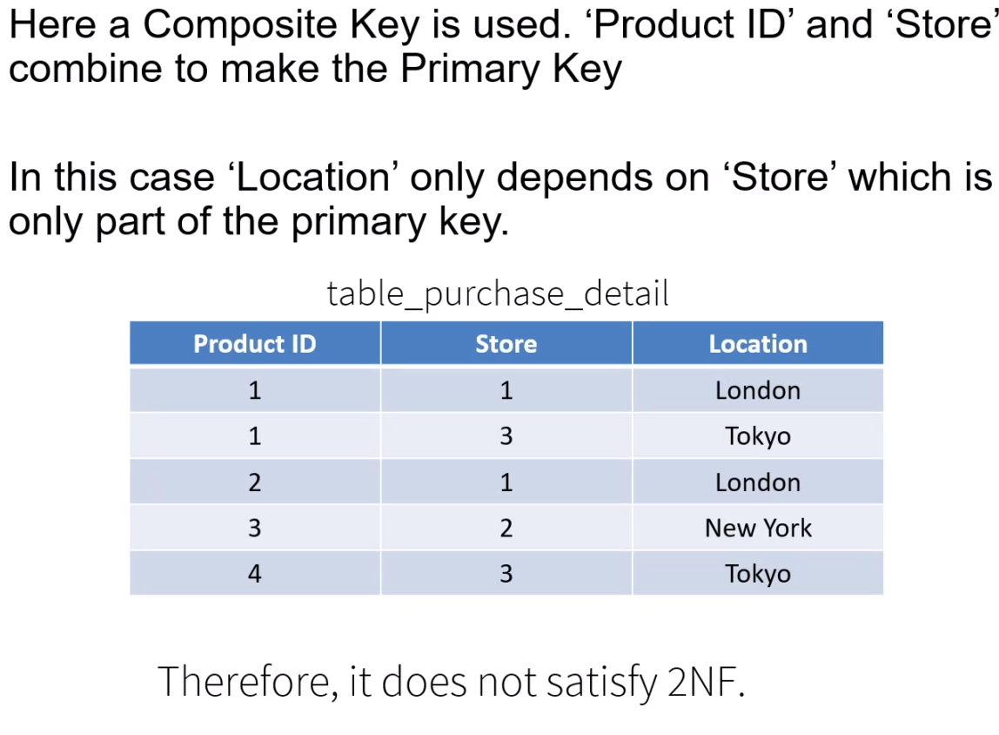
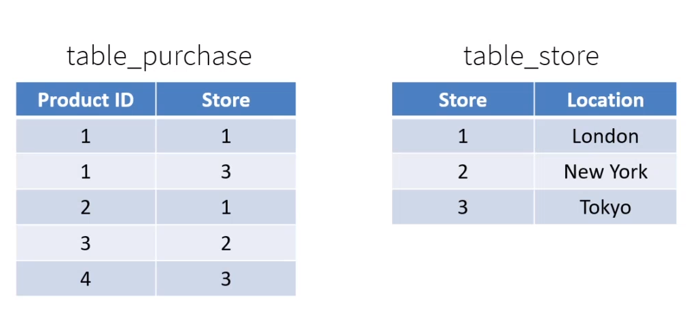
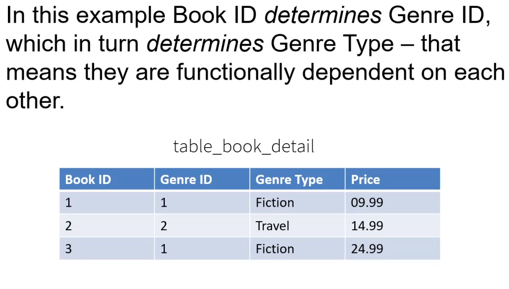
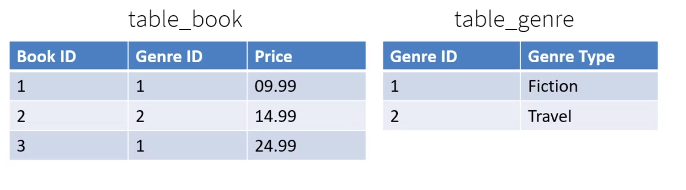
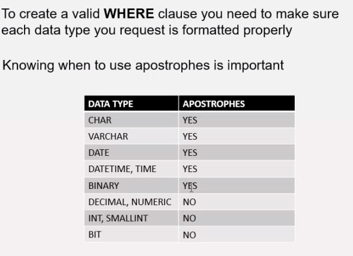
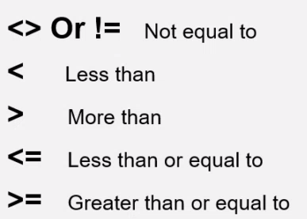
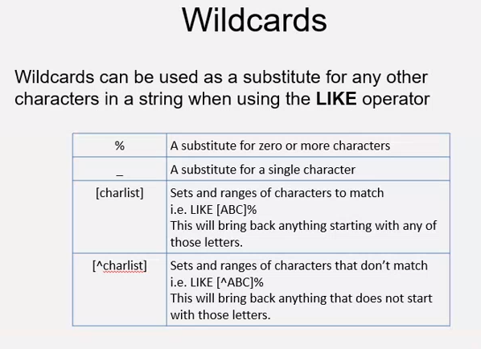

# Week 2  SQL Day 2
## Tuesday 12/05/2020
### Lecture Notes


#### NULL command

NULL is not nothing but it does not equate to zero. It's an undefined value.

= NULL doesn't work

But This works:

``` SQL
WHERE something IS NULL
```
Another way to use it is:

``` SQL
NOT NULL DEAULT 5
```
This means when the value is not null, the default variable becomes 5.

#### Database Considerations
- Data Security
- Data Recovery
- Data Integrity
- Normal Form

#### Storing data on the cloud
- cloud : in the data centre
- imprim : in your own house
- hybrid cloud : some data in your own cloud and some in data centres

Hybrid is mainly used in banks where they will have confidential data in their own data centres and general information in the cloud.

Multizone availability: So if one server goes down, the other can still recover your information since they are all communicating with each other.

#### What is Normalisation?


It gets rid of data redundancies in a Database such as data duplication


There are 3 levels of normalisation

##### 1st Normal Form


- Atomic:

The values in the table should be Atomic which means the data presented must be as small as it can be.

- There should be no repeating groups

[author1] [author2]



Answer:

only one set of data should be inside each column so its not Atomic.

Solution:



Seperate the 2 tables with 1 primary key

##### 2nd Normal Form

- It's in 1st Normal Form


- Functional dependencies: all non-key attributes must be dependent on the primary key

In this table 'location' only depends on store which is only part of the primary key - in regards to the composite key. So its not 2nf



Solution:

Split the table so the 'store' is fully dependent on the primary key.


so the non-key attribute is 'Location' in table_store

##### 3rd Normal Form

- It's in 2nd Normal Form
- No transitive functional dependencies : there should be no dependencies between a non-key attribute and another non-key attributes

In this example 'genre ID' is dependent on 'genre type' so its not a 3nf as there is a 'Book ID primary key'.



Solution:

Split the table, so that only one primary key is dependent on the information in each table  





### Queries Functions




When naming using AS use " " Double Apostrophe

There's a number of operators we can use



wildcards



-------------------------------------------------------------

##### Check the file SQL_day2_example.md for new queries
####
####
